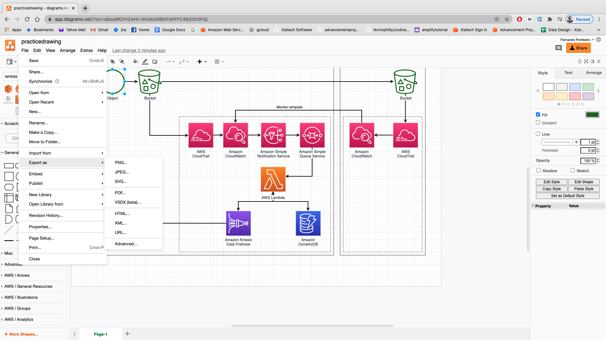

# Architecture Lab for Data Engineering

So- in the lecture portion of the class we've been mostly studying the theory around different tools used in common data architecture patterns. As a quick reminder- the three things we want to focus on for our architecture are: 

* **Velocity**
* **Resilience**
* **Replayability**

What we're going to do in this lab is go through three scenarios that are pretty common in the data architecture world and discuss ETL pipelines that we would create for each.

## Setting up our diagram software

We will then create our own pipelines using a pretty common (and conventiently enough: FREE) architecture drawing tool known as [diagrams.net](https://www.diagrams.net/).

So if you could- please click on the link above. You should come to this screen. Choose "Create New Diagram":

Choose "Cloud" from the left hand choices and then the third choice over on the images:

Click on "Create". 
It will ask if you want to use "root folder". 

This one is completely up to you; if you have a google account then using the root folder in your google drive simply means that the images you create will be saved there by default. 
They can be moved at any time. I usually just default to this one but if you can't for some reason feel free to move.

This will bring up a pretty commonly used template for creating cloud architectures. Take a quick look at this and note the flow of data through this system:

Do you see where the data starts and ends? How it flows through each portion and ultimately ends in an S3 bucket? 

This is commonly what these drawings look like when they are shared with the team by data architects. 
The light outlines that you are seeing there represent the VPCs (Virtual Private Clouds- think networks) that each of these pieces are operating in! 

### Creating our architecture:

The next thing we're going to need to do is make sure that we have aws icons available! In the bottom left corner of the draw.io app please click on "MORE SHAPES" and choose "AWS19" from the list that appears

These will provide you with a vast array of different AWS icons that you can easily add to your architecture drawing. Just to practice this- type "Lambda" into the shapes search bar. You should see a lambda icon appear there. Double click it to add it to the diagram (then delete it please).

Okay...so before we go through and delete everything currently up there let's practice creating a pdf from this thing!

### Effectively saving/sharing your drawings

The first thing we'll want to do here is obviously to name the drawing. Go ahead into the top left corner and click on that. 
Put a name in there as "practice_image". 

NOW we're ready to save and share but before we do let's take a quick look at some of the options for us in draw.io/diagrams.net that make this such a powerful tool for us. Click on the "Share" key under the FILE section:

As you can see this is easy to output in numerous formats (png, jpeg, svg) meaning that you can embed it anywhere from powerpoint to websites. This is fairly useful when you have to present your architecture to your interested parties (and clients). We're going to be doing a bit of this ourselves! 

Okay! SO...we now should have everything we need to begin. Let's get started on our architecture diagram!

## Scenario ONE: HIGH FASHION

Congratulations! You've gotten a contract with a large, fashionable clothing company! They need to ingest an inventory report that is generated by their Inventory management software. Twice a day the inventory management system will update the inventory positions of every piece of stock in the warehouse (in order to update the front end website). This means that they need to get the report from the SFTP server to the SQL server that serves the front end twice a day.
The system you've been asked to set up is as follows:

* There is an inventory report that will be produced by the inventory management software twice a day. This report will be in a .xlsx format. 

* The report will come in at 0600 and 1800 daily

* The report will need to be transformed to a csv format en route and then

* Placed into a Postgres (REDSHIFT) SQL database

This should all be done in a serverless methodology with event driven architecture used after the initial "get" from the SFTP server

You will need to archive the file daily in both the xlsx and csv formats in case you need to rerun everything at some point. 
You will need some code to authenticate with the SFTP server (you don't have to write the code!)

**So what are the deliverables?**

* Please create an architecture diagram and save it

* Please include an explanation of each step that you are taking in the architecture and remember to talk through the **velocity**, **replayability** and **resilience**

* Please be ready to talk through and answer questions and ASK questions of your client (me) about the architecture

